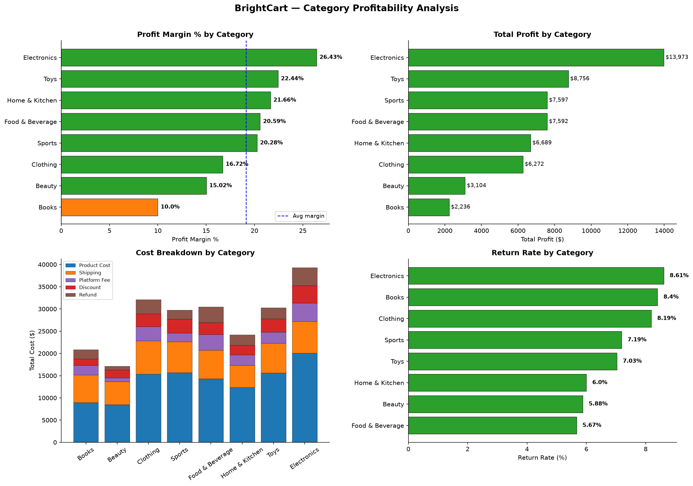
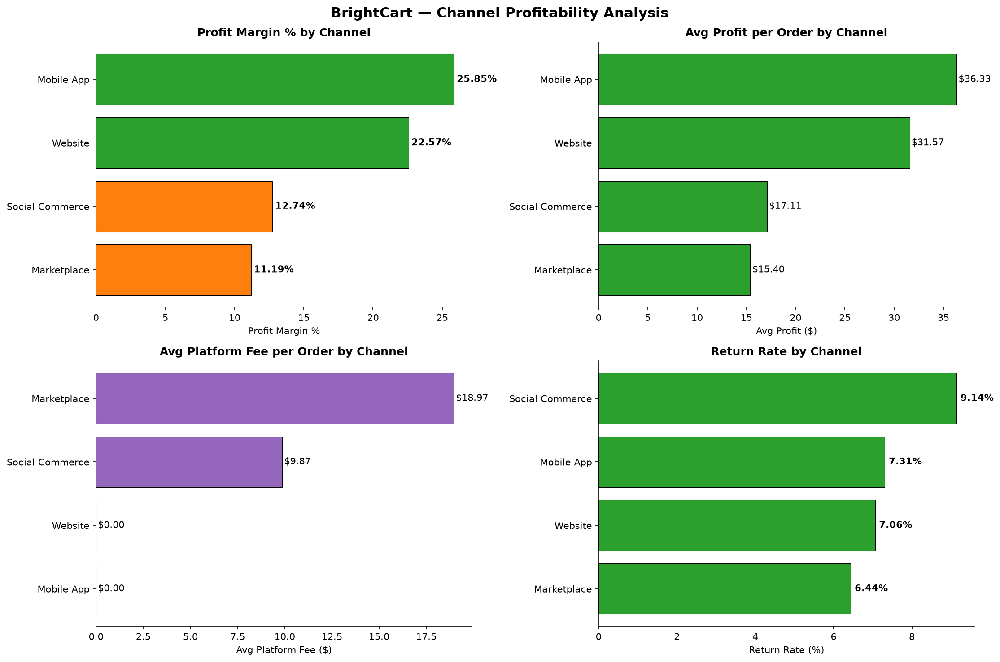
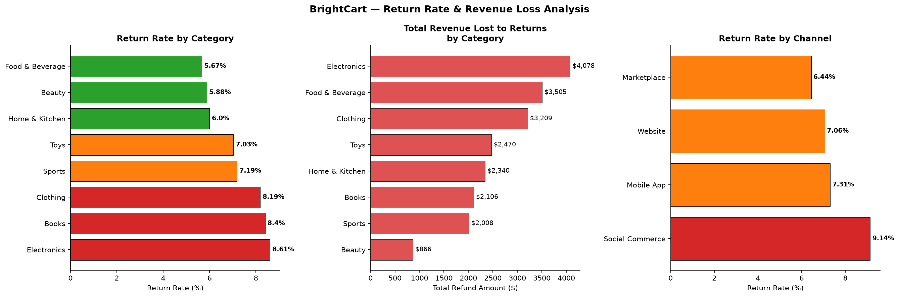
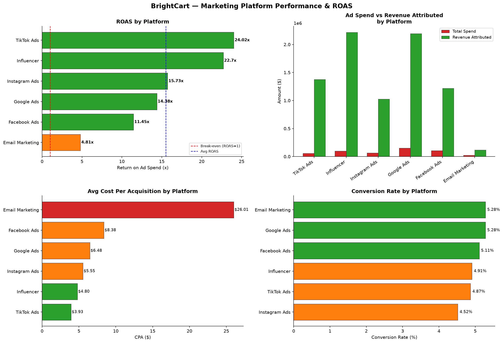
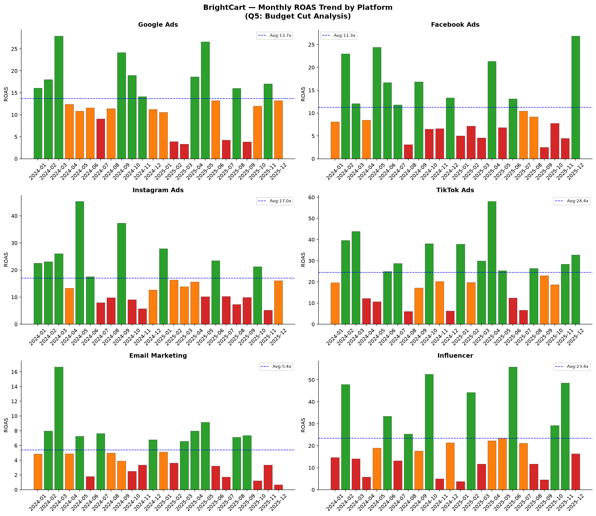

# BrightCart E-Commerce Profitability Analysis
### Online Retailer | 2024–2025


---

## Business Problem

BrightCart is an online retailer selling across 8 product categories
through 4 sales channels — Website, Mobile App, Marketplace, and
Social Commerce. Despite generating $277,648 in gross revenue over
2024–2025, net margins are shrinking.

The CEO wants answers to three questions:

> *"Which categories and channels are truly profitable after all costs?"*
> *"Which marketing platforms are delivering real return on spend?"*
> *"Is our return rate eating into our margins?"*

---

## Project Structure
brightcart-analysis/

├── data/

│   ├── orders.csv                    ← raw order transactions

│   ├── products.csv                  ← product catalog with costs

│   ├── marketing_spend.csv           ← monthly spend by platform

│   ├── order_clean.csv               ← cleaned orders (1997 rows)

│   ├── products_clean.csv            ← cleaned products

│   └── marketing_clean.csv           ← cleaned marketing data

├── notebooks/

│   ├── data_cleaning.ipynb           ← validation + cleaning

│   └── eda_analysis.ipynb            ← 5 charts answering all questions

├── sql/

│   └── analysis.sql                  ← 7 sections, window functions

├── reports/

│   ├── profitability_memo.md         ← CEO-level executive summary

│   ├── chart1_category_profitability.png

│   ├── chart2_channel_profitability.png

│   ├── chart3_returns_analysis.png

│   ├── chart4_marketing_roas.png

│   ├── chart5_budget_cut_analysis.png

│   ├── dashboard.pbix                ← Power BI interactive dashboard

│   └── reports.pdf                   ← full report (PDF export)

└── README.md

---

## Tech Stack

| Tool | Purpose |
|---|---|
| Python (pandas, matplotlib) | Cleaning, EDA, visualization |
| MySQL | Structured queries, window functions |
| Excel | Budget scenario modeling |
| GitHub | Version control + documentation |

---

## Dataset

- **Source:** Analyst Builder — BrightCart Project
- **Orders:** 1,997 transactions across 2024–2025
- **Products:** 207 SKUs across 8 categories
- **Marketing:** 144 rows — 6 platforms × 24 months
- **Key columns:** gross_revenue, profit, platform_fee,
  refund_amount, returned, channel, primary_category,
  roas, spend, revenue_attributed

---

## Key Findings

### ⚠️ Headline: 28.19% of Orders Are Unprofitable
563 of 1,997 orders generated negative profit — the primary
driver of shrinking net margins.

---

### 1. Category Profitability

| Category | Margin % | Total Profit |
|---|---|---|
| Electronics | 26.43% 🟢 | $13,973 |
| Toys | 22.44% 🟢 | $8,756 |
| Home & Kitchen | 21.66% 🟢 | $6,689 |
| Food & Beverage | 20.59% 🟢 | $7,592 |
| Sports | 20.28% 🟢 | $7,597 |
| Clothing | 16.72% 🟠 | $6,272 |
| Beauty | 15.02% 🟠 | $3,104 |
| Books | 10.00% 🔴 | $2,236 |

Books underperforms due to high shipping cost relative
to low selling price. Beauty underperforms due to
aggressive discounting — not returns.

---

### 2. Channel Profitability

| Channel | Margin % | Avg Profit/Order | Platform Fee |
|---|---|---|---|
| Mobile App | 25.85% 🟢 | $36.33 | $0.00 |
| Website | 22.57% 🟢 | $31.57 | $0.00 |
| Social Commerce | 12.74% 🟠 | $17.11 | $9.87 |
| Marketplace | 11.19% 🟠 | $15.40 | $18.97 |

Marketplace platform fee of $18.97/order cuts avg profit
per order by 55% vs owned channels. Mobile App is the
most efficient channel with zero fees and highest
avg profit per order.

---

### 3. Return Rate Analysis

| Category | Return Rate | Revenue Lost |
|---|---|---|
| Electronics | 8.61% 🔴 | $4,078 |
| Books | 8.40% 🔴 | $2,106 |
| Clothing | 8.19% 🔴 | $3,209 |
| Beauty | 5.88% 🟢 | $866 |
| Food & Beverage | 5.67% 🟢 | $3,505 |

Total revenue lost to returns: **$20,582**
Social Commerce has the highest channel return rate
at 9.14% — social discovery creates expectation
mismatches leading to higher returns.

---

### 4. Marketing ROAS

| Platform | ROAS | CPA | Verdict |
|---|---|---|---|
| TikTok Ads | 24.4x 🟢 | $3.93 | Best performer |
| Influencer | 23.4x 🟢 | $4.80 | High efficiency |
| Instagram Ads | 17.0x 🟢 | $5.55 | Strong |
| Google Ads | 13.7x 🟢 | $6.48 | Average |
| Facebook Ads | 11.3x 🟠 | $8.38 | Reduce significantly |
| Email Marketing | 5.4x 🔴 | $26.01 | Reduce aggressively |

Email Marketing costs **$26.01 per acquisition** — 6.6x more
than TikTok's $3.93. Budget is being burned on the lowest-ROAS
platform while the highest-ROAS channels are under-invested.

---

### 5. Budget Reallocation Opportunity

Cutting underperformers and reinvesting into top platforms:

| Platform | Action | Amount |
|---|---|---|
| Email Marketing | Cut 60% | Save $14,677 |
| Facebook Ads | Cut 40% | Save $42,581 |
| Google Ads | Cut 26% | Save $39,662 |
| Instagram Ads | Cut 5% | Save $3,258 |
| **TikTok Ads** | **Increase** | Reinvest savings |
| **Influencer** | **Increase** | Reinvest savings |

**Total reallocated:** ~$100,701 moved from 5.4–11.3x ROAS
platforms to 23–24x ROAS platforms — potential 3–4x increase
in revenue per marketing dollar.

---

## Top 3 Recommendations

### 1️⃣ Fix the Books Margin Problem
Books generates only **10% margin** vs 19% company average.
- **Root cause:** High shipping cost relative to low selling price.
- **Action:** Introduce a minimum order value of $35 for free
  shipping on Books. Orders below threshold pay shipping.
- **Expected impact:** Books margin improves from 10% → 14–16%.

### 2️⃣ Shift Volume from Marketplace to Mobile App
Marketplace earns **$15.40** avg profit per order vs
Mobile App's **$36.33** — a 2.36x difference driven entirely
by the $18.97 platform fee.
- **Action:** Run Mobile App exclusive promotions and reduce
  SKUs listed on Marketplace to only high-margin Electronics
  and Toys where the fee is absorbed.
- **Expected impact:** $10–15 additional profit per redirected order.

### 3️⃣ Reallocate 20% of Marketing Budget
Cut **$100,701** from underperforming platforms (Email, Facebook,
Google) and reinvest into TikTok Ads and Influencer marketing.
- **Expected impact:** Moving budget from 5.4x ROAS to 24.4x
  ROAS platforms could increase revenue attributed per marketing
  dollar by 3–4x.

---

## Charts

| Chart | Description |
|---|---|
|  | Profit margin and total profit by product category |
|  | Channel comparison — margin %, avg profit, platform fees |
|  | Return rate and revenue lost by category |
|  | ROAS and CPA across 6 marketing platforms |
|  | Proposed budget reallocation scenario |

---

## How to Reproduce

### 1. Clone the repository
```bash
git clone https://github.com/ShubhamSahu-2005/Ecommerce-Profitability-Analysis.git
cd Ecommerce-Profitability-Analysis
```

### 2. Install Python dependencies
```bash
pip install pandas matplotlib seaborn jupyter
```

### 3. Run the notebooks
```bash
jupyter notebook notebooks/data_cleaning.ipynb   # Step 1: Clean raw data
jupyter notebook notebooks/eda_analysis.ipynb     # Step 2: EDA + 5 charts
```

### 4. (Optional) Run SQL analysis
Load `data/order_clean.csv`, `data/products_clean.csv`, and
`data/marketing_clean.csv` into a MySQL 8.0 database and
execute the queries in `sql/analysis.sql`.

### 5. (Optional) View the dashboard
Open `reports/dashboard.pbix` in Power BI Desktop to explore
the interactive dashboard.

---

## Conclusion

BrightCart's margin erosion is **not a revenue problem** — it is
a **cost structure and allocation problem**. The company is selling
the right products (strong category margins) through the wrong mix
of channels (too much Marketplace) with misallocated marketing
spend (too much Facebook/Email).

Implementing these three recommendations targets the three largest
margin leaks simultaneously and can bring net margin meaningfully
closer to healthy e-commerce benchmarks of **20%+**.

---

## Author

**Shubham Sahu**
- 🔗 [GitHub](https://github.com/ShubhamSahu-2005)
- 📄 [Executive Memo](reports/profitability_memo.md)
- 📊 [Full Report (PDF)](reports/reports.pdf)

*Analysis conducted using Python (pandas, matplotlib), MySQL, and Power BI.*
*Dataset: BrightCart synthetic retail dataset, 2024–2025.*